```mermaid

graph TD

    subgraph "Upgraded Residual Attention U-Net"

        Input["Input (256×256×3)"]

        E1["Res Block (32) → MaxPool"]

        E2["Res Block (64) → MaxPool"]

        E3["Res Block (128) → MaxPool"]

        E4["Res Block (256) → MaxPool"]

        B["Bottleneck: Res Block (512) + Dropout(0.4)"]

        AG4["Attention Gate"]

        D4["Decoder: Res Block (256)"]

        AG3["Attention Gate"]

        D3["Decoder: Res Block (128)"]

        AG2["Attention Gate"]

        D2["Decoder: Res Block (64)"]

        AG1["Attention Gate"]

        D1["Decoder: Res Block (32)"]

        Out["Conv2D(1,1) + Sigmoid → Mask (256×256×1)"]

 

        Input --> E1 --> E2 --> E3 --> E4 --> B

        B -->|"UpSample"| AG4

        E4 -->|"skip"| AG4

        AG4 --> D4

        D4 -->|"UpSample"| AG3

        E3 -->|"skip"| AG3

        AG3 --> D3

        D3 -->|"UpSample"| AG2

        E2 -->|"skip"| AG2

        AG2 --> D2

        D2 -->|"UpSample"| AG1

        E1 -->|"skip"| AG1

        AG1 --> D1

        D1 --> Out

    end

```

# Attention-Enhanced U-Net for Pet Image Segmentation — Complete Project Guide

 

## 1. What Is This Application About?

 

This project tackles **semantic image segmentation** — the task of classifying every single pixel in an image as belonging to either the **foreground** (the pet/animal) or the **background**. The system takes an ordinary photograph of a cat or dog and produces a **pixel-level binary mask** that precisely outlines the animal's shape.

 

> [!NOTE]

> Image segmentation is a fundamental building block in computer vision. It powers applications like:

> - **Medical imaging** (tumour boundary detection, organ segmentation)

> - **Autonomous driving** (road/pedestrian/vehicle segmentation)

> - **Augmented reality** (background removal, virtual try-on)

> - **Satellite/remote sensing** (land-use classification)

 

---

 

## 2. Dataset: Oxford-IIIT Pet

 

Both notebooks use the **Oxford-IIIT Pet** dataset, loaded via `tensorflow_datasets`:

 

| Property | Value |

|---|---|

| **Training images** | ~3,680 |

| **Test images** | ~3,669 |

| **Classes** | 37 pet breeds (but used here for binary foreground/background) |

| **Annotations** | Per-pixel segmentation masks (3-class: pet, background, border → collapsed to binary) |

 

The raw segmentation masks have values `{1, 2, 3}`. Both notebooks convert these to **binary masks** (`0.0` = background, `1.0` = pet) via:

```python

mask = tf.where(mask > 1, 1.0, 0.0)

```

 

---

 

## 3. The Baseline Notebook (`attention-unet`)

 

### 3.1 What It Does

 

The baseline notebook builds and compares **two** U-Net variants side-by-side:

 

1. **Baseline U-Net** — a vanilla encoder-decoder architecture with skip connections.

2. **Baseline + Channel Attention** — the same architecture with one Squeeze-and-Excitation (SE) style **channel attention block** inserted at the bottleneck only.

 

### 3.2 Architecture Details

 

#### Encoder

| Stage | Operation | Filters |

|---|---|---|

| 1 | `conv_block(inputs, 32)` → MaxPool | 32 |

| 2 | `conv_block(p1, 64)` → MaxPool | 64 |

 

#### Bottleneck

- `conv_block(p2, 128)` + `Dropout(0.3)`

- For the "attention" variant: an SE-style channel attention block is inserted **here only**.

 

#### Decoder

| Stage | Operation | Filters |

|---|---|---|

| 1 | UpSampling2D → Concatenate with encoder skip → `conv_block(64)` | 64 |

| 2 | UpSampling2D → Concatenate with encoder skip → `conv_block(32)` | 32 |

| Output | `Conv2D(1, 1, activation='sigmoid')` | 1 |

 

#### `conv_block`

```python

def conv_block(x, filters):

    x = Conv2D(filters, 3, padding='same', activation='relu')(x)

    x = Conv2D(filters, 3, padding='same', activation='relu')(x)

    return x

```

- No Batch Normalization

- No residual/skip within the block itself

 

#### Channel Attention Block (SE-style)

```python

def attention_block(x):

    g = GlobalAveragePooling2D()(x)

    g = Dense(x.shape[-1]//8, activation='relu')(g)

    g = Dense(x.shape[-1], activation='sigmoid')(g)

    g = Reshape((1, 1, x.shape[-1]))(g)

    return multiply([x, g])

```

This is a **channel attention** mechanism (Squeeze-and-Excitation style): it learns which *channels* are important but does not attend to *spatial* locations.

 

### 3.3 Training Configuration

 

| Setting | Value |

|---|---|

| **Image size** | 128×128 |

| **Batch size** | 16 |

| **Epochs** | 10 |

| **Optimizer** | Adam (default LR = 0.001) |

| **Loss** | BCE + Dice Loss |

| **Data augmentation** | None |

| **Callbacks** | None (no early stopping, no LR scheduling) |

| **Mixed precision** | No |

| **Random seed** | Not set |

 

### 3.4 Results

 

| Metric | Baseline U-Net | + Channel Attention |

|---|---|---|

| **Val IoU** | 0.7972 | 0.8120 |

| **Val Dice** | 0.8869 | 0.8960 |

| **Val Loss** | 0.3837 | 0.3631 |

 

> [!IMPORTANT]

> The attention variant shows modest improvement (~1.5% IoU), but only applies attention at the **bottleneck** and uses no other regularization or training enhancements.

 

---

 

## 4. The Upgraded Notebook (`upgraded-attention-u-net`)

 

### 4.1 What It Does Differently

 

The upgraded notebook is a **comprehensive overhaul** of every component — architecture, loss function, training strategy, and evaluation — designed to push segmentation quality significantly higher.

 

### 4.2 Key Upgrades Summary

 

| Aspect | Baseline | Upgraded |

|---|---|---|

| **Image size** | 128×128 | **256×256** |

| **Epochs** | 10 | **20** (with Early Stopping) |

| **Optimizer LR** | 0.001 (default) | **0.0001** (explicit) |

| **Encoder depth** | 2 levels | **4 levels** |

| **Bottleneck filters** | 128 | **512** |

| **Total params** | ~471K | **~8.4M** |

| **Conv blocks** | Plain Conv2D + ReLU | **Residual blocks with BN** |

| **Attention type** | SE channel attention (bottleneck only) | **Spatial Attention Gates** (every skip connection) |

| **Loss function** | BCE + Dice | **BCE + Tversky** |

| **Data augmentation** | None | **Flips, brightness, contrast** |

| **Callbacks** | None | **ModelCheckpoint, ReduceLROnPlateau, EarlyStopping** |

| **Mixed precision** | No | **Yes (`mixed_float16`)** |

| **Random seed** | Not set | **Set (42)** |

 

### 4.3 Architecture Details

 

#### Residual Block with Batch Normalization

```python

def res_block(x, filters):

    shortcut = Conv2D(filters, 1, padding='same')(x)

    shortcut = BatchNormalization()(shortcut)

    x = Conv2D(filters, 3, padding='same')(x)

    x = BatchNormalization()(x)

    x = Activation('relu')(x)

    x = Conv2D(filters, 3, padding='same')(x)

    x = BatchNormalization()(x)

    x = Add()([x, shortcut])

    x = Activation('relu')(x)

    return x

```

 

> [!TIP]

> **Why residual blocks?** They solve the vanishing gradient problem, enabling the deeper (4-level) encoder to train effectively. BN stabilizes training and allows faster convergence.

 

#### Spatial Attention Gate (Oktay et al., 2018)

```python

def attention_gate(x, g, inter_ch):

    theta = Conv2D(inter_ch, 1, padding='same')(x)

    phi   = Conv2D(inter_ch, 1, padding='same')(g)

    if theta.shape[1] != phi.shape[1]:

        phi = UpSampling2D()(phi)

    add = Activation('relu')(Add()([theta, phi]))

    psi = Conv2D(1, 1, padding='same', activation='sigmoid')(add)

    return multiply([x, psi])

```

 

> [!IMPORTANT]

> **Key difference from baseline**: This is a **spatial** attention gate — it learns which *spatial locations* in the skip connection are relevant to the current decoder stage. It is applied at **every** skip connection (4 total), not just the bottleneck. This produces much better boundary delineation.

 

#### Encoder (4 levels)

| Stage | Block | Filters | Output Resolution |

|---|---|---|---|

| 1 | `res_block` → MaxPool | 32 | 128×128 |

| 2 | `res_block` → MaxPool | 64 | 64×64 |

| 3 | `res_block` → MaxPool | 128 | 32×32 |

| 4 | `res_block` → MaxPool | 256 | 16×16 |

 

#### Bottleneck

- `res_block(p4, 512)` + `Dropout(0.4)`

 

#### Decoder (with attention gates on every skip)

| Stage | Skip From | Attention Gate | Filters |

|---|---|---|---|

| D4 | c4 (256) | ✅ inter_ch=128 | 256 |

| D3 | c3 (128) | ✅ inter_ch=64 | 128 |

| D2 | c2 (64) | ✅ inter_ch=32 | 64 |

| D1 | c1 (32) | ✅ inter_ch=16 | 32 |

 

### 4.4 Loss Function: BCE + Tversky Loss

 

The upgraded notebook replaces Dice Loss with **Tversky Loss**:

 

```python

def tversky_loss(y_true, y_pred, alpha=0.7, smooth=1.0):

    tp = K.sum(y_true * y_pred)

    fp = K.sum((1 - y_true) * y_pred)

    fn = K.sum(y_true * (1 - y_pred))

    return 1.0 - (tp + smooth) / (tp + alpha*fn + (1-alpha)*fp + smooth)

```

 

> [!TIP]

> **Why Tversky over Dice?** With `alpha=0.7`, Tversky **penalizes false negatives more heavily** than false positives. This is ideal for segmentation tasks where missing parts of the pet (under-segmentation) is worse than slightly over-segmenting.

 

### 4.5 Data Augmentation

 

```python

def augment(image, mask):

    if tf.random.uniform(()) > 0.5:

        image = tf.image.flip_left_right(image)

        mask  = tf.image.flip_left_right(mask)

    if tf.random.uniform(()) > 0.5:

        image = tf.image.flip_up_down(image)

        mask  = tf.image.flip_up_down(mask)

    image = tf.image.random_brightness(image, 0.15)

    image = tf.image.random_contrast(image, 0.8, 1.2)

    image = tf.clip_by_value(image, 0.0, 1.0)

    return image, mask

```

 

Key augmentations and **why**:

- **Horizontal/vertical flips** → teaches rotation invariance; pets can appear in any orientation.

- **Random brightness/contrast** → teaches robustness to lighting conditions.

- **Masks are flipped identically** → maintains pixel-label alignment.

 

### 4.6 Training Strategy

 

| Component | Purpose |

|---|---|

| **Mixed precision (`mixed_float16`)** | ~2× faster training on GPU via FP16 computation |

| **ModelCheckpoint** | Saves best model based on `val_iou_coef` (mode='max') |

| **ReduceLROnPlateau** | Halves LR after 3 epochs without val_loss improvement (min LR = 1e-7) |

| **EarlyStopping** | Stops after 6 epochs without val_iou improvement; restores best weights |

| **Seed setting** | `tf.random.set_seed(42)` + `np.random.seed(42)` for reproducibility |

 

### 4.7 Results

 

| Metric | Baseline (upgraded notebook) | Residual Attention U-Net |

|---|---|---|

| **Val IoU** | 0.7610 | **0.8744** |

| **Val Dice** | 0.8640 | **0.9328** |

| **Val Loss** | 0.4737 | **0.2679** |

| **Val Accuracy** | 0.8455 | **0.9240** |

 

> [!IMPORTANT]

> The upgraded Attention U-Net achieves a **+11.3 percentage point** IoU improvement over the baseline in the same notebook, and a **+6.2 percentage point** improvement over the original attention model from the first notebook (0.8744 vs 0.8120).

 

---

 

## 5. Why Each Upgrade Matters

 

### 5.1 Higher Resolution (128→256)

More pixels = finer spatial detail = better boundary delineation. The model can distinguish pet fur edges, paws, and ear shapes more precisely.

 

### 5.2 Deeper Network (2→4 encoder levels)

More levels of abstraction allow the model to capture both **low-level features** (edges, textures) and **high-level features** (body parts, overall shape) simultaneously.

 

### 5.3 Residual Blocks + Batch Normalization

- **Residual connections** prevent gradient degradation in deep networks

- **Batch normalization** accelerates convergence and acts as regularization

 

### 5.4 Spatial Attention Gates vs. Channel Attention

- **Channel attention** (baseline): "Which feature *channels* matter?" → limited spatial reasoning

- **Spatial attention gates** (upgraded): "Which *spatial locations* in the skip connection are relevant?" → much better at focusing on the object boundary and suppressing background noise

 

### 5.5 Tversky Loss (α=0.7)

Prioritizes recall over precision, making the model less likely to miss parts of the pet in the segmentation mask.

 

### 5.6 Data Augmentation

Prevents overfitting on the relatively small training set (~3,680 images) by artificially increasing effective dataset size and diversity.

 

### 5.7 LR Scheduling + Early Stopping

- **Lower initial LR (1e-4)** → more stable training for the larger model

- **ReduceLROnPlateau** → fine-tunes weights as training plateaus

- **EarlyStopping** → prevents overfitting and saves compute time

 

### 5.8 Mixed Precision Training

Uses FP16 for computation and FP32 for accumulation, roughly doubling GPU throughput without meaningful accuracy loss.

 

---

 

## 6. Overall Architecture Diagram

 



 

---

 

## 7. Conclusion

 

This project demonstrates a **systematic, principled approach** to improving a deep learning image segmentation model:

 

1. **Start simple** (baseline U-Net) to establish a performance floor.

2. **Upgrade the architecture** (deeper encoder, residual blocks, spatial attention gates) to increase representational capacity.

3. **Improve the loss function** (Tversky) to better match the task's priorities.

4. **Add data augmentation** to combat overfitting on limited data.

5. **Refine training strategy** (LR scheduling, early stopping, mixed precision) to extract maximum performance.

6. **Compare rigorously** using standardized metrics (IoU, Dice, Loss, Accuracy) across both approaches.

 

The result: a **+11.3 pp IoU improvement** (from 0.7610 to 0.8744 in the upgraded notebook) — a substantial gain achieved through thoughtful engineering rather than any single silver bullet.

 


| **Encoder depth** | 2 levels | **4 levels** |

| **Bottleneck filters** | 128 | **512** |

| **Total params** | ~471K | **~8.4M** |

| **Conv blocks** | Plain Conv2D + ReLU | **Residual blocks with BN** |

| **Attention type** | SE channel attention (bottleneck only) | **Spatial Attention Gates** (every skip connection) |

| **Loss function** | BCE + Dice | **BCE + Tversky** |

| **Data augmentation** | None | **Flips, brightness, contrast** |

| **Callbacks** | None | **ModelCheckpoint, ReduceLROnPlateau, EarlyStopping** |

| **Mixed precision** | No | **Yes (`mixed_float16`)** |

| **Random seed** | Not set | **Set (42)** |

 

### 4.3 Architecture Details

 

#### Residual Block with Batch Normalization

```python

def res_block(x, filters):

    shortcut = Conv2D(filters, 1, padding='same')(x)

    shortcut = BatchNormalization()(shortcut)

    x = Conv2D(filters, 3, padding='same')(x)

    x = BatchNormalization()(x)

    x = Activation('relu')(x)

    x = Conv2D(filters, 3, padding='same')(x)

    x = BatchNormalization()(x)

    x = Add()([x, shortcut])

    x = Activation('relu')(x)

    return x

```

 

> [!TIP]

> **Why residual blocks?** They solve the vanishing gradient problem, enabling the deeper (4-level) encoder to train effectively. BN stabilizes training and allows faster convergence.

 

#### Spatial Attention Gate (Oktay et al., 2018)

```python

def attention_gate(x, g, inter_ch):

    theta = Conv2D(inter_ch, 1, padding='same')(x)

    phi   = Conv2D(inter_ch, 1, padding='same')(g)

    if theta.shape[1] != phi.shape[1]:

        phi = UpSampling2D()(phi)

    add = Activation('relu')(Add()([theta, phi]))

    psi = Conv2D(1, 1, padding='same', activation='sigmoid')(add)

    return multiply([x, psi])

```

 

> [!IMPORTANT]

> **Key difference from baseline**: This is a **spatial** attention gate — it learns which *spatial locations* in the skip connection are relevant to the current decoder stage. It is applied at **every** skip connection (4 total), not just the bottleneck. This produces much better boundary delineation.

 

#### Encoder (4 levels)

| Stage | Block | Filters | Output Resolution |

|---|---|---|---|

| 1 | `res_block` → MaxPool | 32 | 128×128 |

| 2 | `res_block` → MaxPool | 64 | 64×64 |

| 3 | `res_block` → MaxPool | 128 | 32×32 |

| 4 | `res_block` → MaxPool | 256 | 16×16 |

 

#### Bottleneck

- `res_block(p4, 512)` + `Dropout(0.4)`

 

#### Decoder (with attention gates on every skip)

| Stage | Skip From | Attention Gate | Filters |

|---|---|---|---|

| D4 | c4 (256) | ✅ inter_ch=128 | 256 |

| D3 | c3 (128) | ✅ inter_ch=64 | 128 |

| D2 | c2 (64) | ✅ inter_ch=32 | 64 |

| D1 | c1 (32) | ✅ inter_ch=16 | 32 |

 

### 4.4 Loss Function: BCE + Tversky Loss

 

The upgraded notebook replaces Dice Loss with **Tversky Loss**:

 

```python

def tversky_loss(y_true, y_pred, alpha=0.7, smooth=1.0):

    tp = K.sum(y_true * y_pred)

    fp = K.sum((1 - y_true) * y_pred)

    fn = K.sum(y_true * (1 - y_pred))

    return 1.0 - (tp + smooth) / (tp + alpha*fn + (1-alpha)*fp + smooth)

```

 

> [!TIP]

> **Why Tversky over Dice?** With `alpha=0.7`, Tversky **penalizes false negatives more heavily** than false positives. This is ideal for segmentation tasks where missing parts of the pet (under-segmentation) is worse than slightly over-segmenting.

 

### 4.5 Data Augmentation

 

```python

def augment(image, mask):

    if tf.random.uniform(()) > 0.5:

        image = tf.image.flip_left_right(image)

        mask  = tf.image.flip_left_right(mask)

    if tf.random.uniform(()) > 0.5:

        image = tf.image.flip_up_down(image)

Prevents overfitting on the relatively small training set (~3,680 images) by artificially increasing effective dataset size and diversity.

 

### 5.7 LR Scheduling + Early Stopping

- **Lower initial LR (1e-4)** → more stable training for the larger model

- **ReduceLROnPlateau** → fine-tunes weights as training plateaus

- **EarlyStopping** → prevents overfitting and saves compute time

 

### 5.8 Mixed Precision Training

Uses FP16 for computation and FP32 for accumulation, roughly doubling GPU throughput without meaningful accuracy loss.

 

---

 

## 6. Overall Architecture Diagram

 


 

---

 

## 7. Conclusion

 

This project demonstrates a **systematic, principled approach** to improving a deep learning image segmentation model:

 

1. **Start simple** (baseline U-Net) to establish a performance floor.

2. **Upgrade the architecture** (deeper encoder, residual blocks, spatial attention gates) to increase representational capacity.

3. **Improve the loss function** (Tversky) to better match the task's priorities.

4. **Add data augmentation** to combat overfitting on limited data.

5. **Refine training strategy** (LR scheduling, early stopping, mixed precision) to extract maximum performance.

6. **Compare rigorously** using standardized metrics (IoU, Dice, Loss, Accuracy) across both approaches.

 

The result: a **+11.3 pp IoU improvement** (from 0.7610 to 0.8744 in the upgraded notebook) — a substantial gain achieved through thoughtful engineering rather than any single silver bullet.
